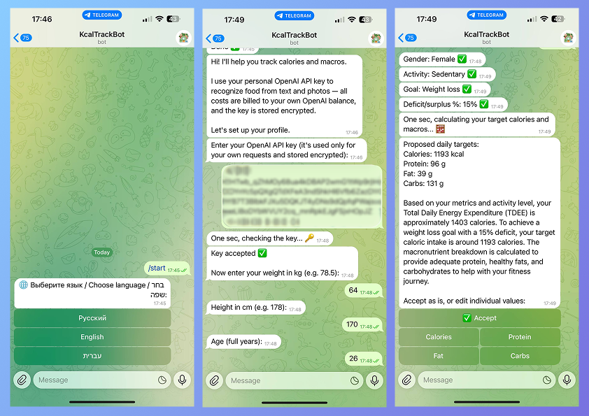
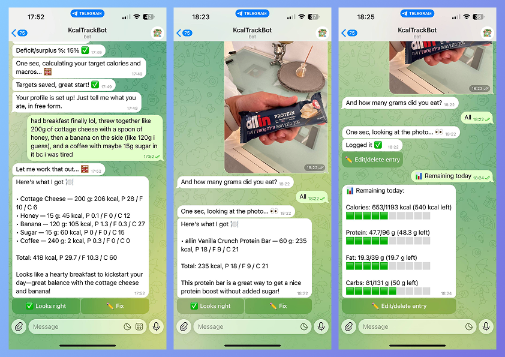

# Calorie Tracker Bot

Because "I'll just estimate the portion size" is how every diet actually goes off the rails.

A Telegram bot that tracks calories and macros (protein/fat/carbs). Just tell it what you ate —
in free text or a photo — and it figures out the numbers for you via the OpenAI API.

Each user connects their **own** OpenAI API key (stored encrypted) — food recognition and target
calculations run under their identity and are billed to their own OpenAI balance, not a shared key.

## How it works



1. On `/start`, you pick a language, paste your OpenAI API key (validated with a cheap `models.list`
   call, then stored encrypted with Fernet), and answer a few questions about yourself.
2. OpenAI computes your TDEE and daily calorie/macro targets from that; you can accept them as-is
   or tweak any single value before they're saved.
3. From then on, just message the bot what you ate — plain text or a photo of the food/label.
   The message goes to OpenAI as your own key, with a prompt asking for strict JSON back: items,
   grams, and calories/macros per item. You confirm or ask it to redo the read before it's saved.



4. Everything (profile, food log, weigh-ins) lives in a single SQLite file. A background scheduler
   (APScheduler) pings you once a week to log your weight, and a small per-user "known foods" table
   lets the bot skip re-guessing a product's macros once it's seen it before.
5. The bot process itself only ever sees your *encrypted* key — it's decrypted in memory just long
   enough to make the OpenAI call, using your own quota, not a shared one.

## Features

- Onboarding that calculates your daily calorie/macro targets from weight, height, age, activity
  level and goal (AI-proposed, editable field by field)
- Log food by free text or photo — items and macros parsed automatically
- Remembers your frequently-eaten foods so it doesn't have to guess twice
- "Remaining today" and per-day history, with an undo/delete option for logged entries
- Weekly weigh-in reminder
- Interface in English, Russian, and Hebrew
- `/stats` — a private command (owner-only, via `ADMIN_TELEGRAM_IDS`) showing user counts and
  daily/weekly activity

## Quick start

```bash
python3 -m venv .venv
source .venv/bin/activate
pip install -r requirements.txt

cp .env.example .env
# fill in TELEGRAM_BOT_TOKEN
python -c "from cryptography.fernet import Fernet; print(Fernet.generate_key().decode())"
# paste the result into ENCRYPTION_KEY

python -m bot.main
```

## Deploying on a Raspberry Pi

Copy the project to the Pi (e.g. `/home/pi/calorie_bot`), fill in `TELEGRAM_BOT_TOKEN` if you
already made a `.env` (otherwise the installer creates one for you), then run:

```bash
./deploy/install.sh
```

That one script sets up the venv, installs dependencies, generates `.env`/`ENCRYPTION_KEY` if
missing, installs pm2 if it isn't already on the Pi, starts the bot under it, and enables
auto-start on reboot. Auto-restart on crash is just pm2's default behavior — nothing extra to
configure. It's also safe to re-run any time (e.g. after a `git pull`) — every step only acts if
it isn't already done.

```bash
pm2 logs calorie-bot     # tail logs
pm2 restart calorie-bot
pm2 status
```

Prefer to do it by hand, or want systemd instead of pm2? `deploy/start.sh` is the actual entry
point (`pm2 start deploy/start.sh --name calorie-bot`, or point `deploy/calorie_bot.service`'s
`ExecStart` at it and use `systemctl` as usual) — it just runs the bot, nothing else. The daily DB
backup cron job (`deploy/backup_db.sh` at 3am, logged to `logs/backup.log`) is set up once by
`deploy/install.sh`; if you're doing everything by hand instead, add it yourself:
```bash
crontab -e
# add:
0 3 * * * /path/to/calorie-tracker-bot/deploy/backup_db.sh >> /path/to/calorie-tracker-bot/logs/backup.log 2>&1
```

## Good to know

- Don't rotate `ENCRYPTION_KEY` once users have saved their API keys — the old keys become
  permanently undecryptable, and everyone has to re-enter them via Settings.
- The bot is open to any Telegram user by default — no allowlist, since everyone pays for their
  own OpenAI usage anyway.
- Sure, you could ask to use my hosted instance instead of running your own. I wouldn't recommend
  it — it's running on a Raspberry Pi, and that thing starts sweating at 3 concurrent users, let
  alone 1000. Spin up your own; it's five minutes and it won't quietly fall over on you.
